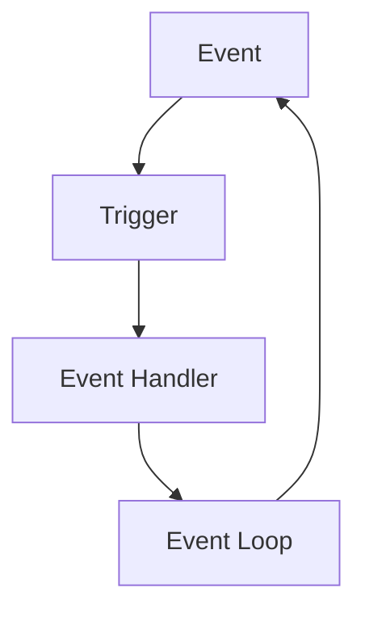

# Smart Mobility
Hong Kong's total population is estimated to reach 8.2M people by 2041 being 2nd dense populated city in the world.

## What is 'Smart Mobility' about?
* Over 12M passenger journeys per day
* over 95% Octopus usage
* Smart Airport Check-in, baggage control system

## What as the needs for developing a smart city in the future?
* Multimodal Intelligent Transportation System
* Public Safety
* Alternative Energy system
* Electric Vehicle Infrastructure
* Smart House
* Water/Gas Distribution management
* Environment Friendly Design Buildings

## 'Smart mobility'

Smart City Planning:
* Integrated development $ spatial Planning
* Transportation & traffic strategy
* Environment & public Safety

System Design, Management & Operation
* Automation
* Real time info
* Advanced control methods

Outcomes and Impacts
* Data driven
* Infrastructure
* Technology Driven
* Efficient
* Safe
* Resilient and reliable
* Green and sustainable

## 'Smart transport system' in 1990s/2000s
Hong Kong pioneered the application of computerised area traffic control technology in Southeast Asia in the 1970's to synchronise traffic signals of road junctions along major routes to minimise stoppage and delay to vehicles (e.g. SCOOT and SCATS systems)

## 'Smart mobility' today
* Multiple sources of data (IoT lampposts)
* Management through communication (ICTm internet, V2I, V2V)
* People oriented
* Multi-objective (focus on reliability, resilience)

Since 2003, Hong Kong progressively installed __Journey Time Indication Systems (JTIS) and Speed Map Panels (SMP)__ in the vicinities of three cross harbour road tunnels as well as tunnels connecting the New Territories with Kowloon to advise motorists expected journey times crossing the tunnels

Since 2011, Hong Kong launched 'HK eTransport', 'HK eRouting', 'eTraffic News' to promote smart mobility. It advises alternative routes and fares by public transport and parking information.

Electronic Road Pricing (ERP) - for pricing toll roads.

# Microbit

## Event Driven Programming
* Code flow is controlled by the user, not the program
* Software can sit idle until an event occur
* Allow software to react
* Example: GUI 

